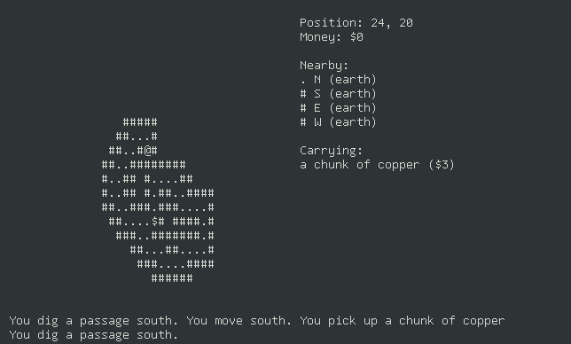

# digger

> The draft of a python curses-based roguelike.

It was never finished, and it will probably never be finished, but it might possibly come in handy as an example of how to use curses to write a roguelike.

## Screenshots

